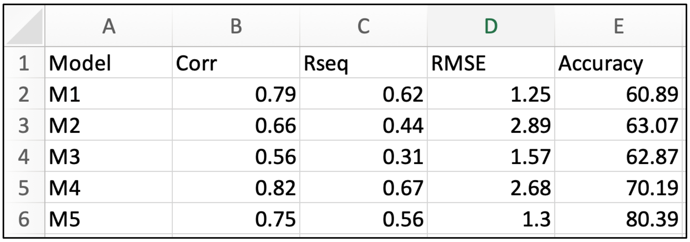
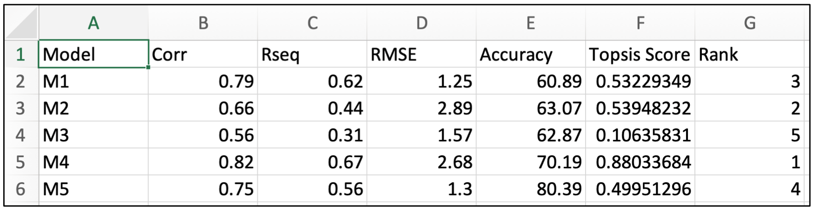

<h1>
<b>TOPSIS</b>
</h1>

Technique for Order Preference by Similarity to Ideal Solution

 

TOPSIS, known as Technique for Order of Preference by Similarity to Ideal Solution, is a multi-criteria decision analysis method. It compares a set of alternatives based on a pre-specified criterion. The method is used in the business across various industries, every time we need to make an analytical decision based on collected data. The mysterious logic of TOPSIS is based on the concept that the chosen alternative should have the shortest geometric distance from the best solution and the longest geometric distance from the worst solution.

<h3>
<b>INPUT</b>
</h3>

 
<h3>
<b>OUTPUT</b>
</h3>

 
